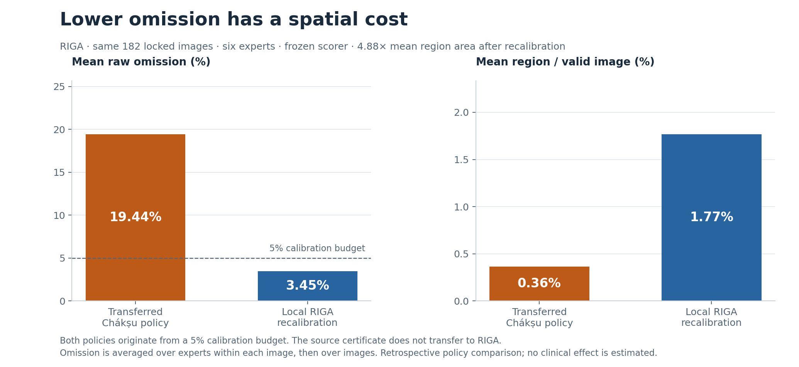

# Research figures

These figures are generated from the verified Chákṣu and RIGA aggregate reports. The only spatial example is synthetic. SVG files preserve editable text; PNG files provide ready-to-use previews. Each image includes the population, units and qualifications needed to interpret it when shared.

| Figure | What to read | Files |
| --- | --- | --- |
| Transfer tradeoff | Same 182 RIGA images: lower omission with local recalibration costs 4.88× mean region area. | [SVG](transfer_tradeoff.svg) · [PNG](transfer_tradeoff.png) |
| Four budgets | All final 1%, 5%, 10% and 20% policies, with separate dataset columns and logarithmic area panels. | [SVG](risk_area_budgets.svg) · [PNG](risk_area_budgets.png) |
| Calibration sample size | Medians and descriptive 5th–95th percentiles from repeated development runs; full pools shown separately. | [SVG](calibration_size.svg) · [PNG](calibration_size.png) |
| Disagreement and sources | Expert-normalized size by disagreement stratum and omission by device/source. Counts and adverse slices remain visible. | [SVG](disagreement_and_sources.svg) · [PNG](disagreement_and_sources.png) |
| Synthetic omission | Five expert masks on a tiny synthetic image, with expanding predictions and excluded padding. | [SVG](synthetic_omission.svg) · [PNG](synthetic_omission.png) |



## Regenerate and verify

After installing the base package:

```sh
python -m pip install ".[figures]"
rcms figures --output results/figures
rcms verify-figures docs/figures/plot_data.json
```

For the complete dependency lock, use `uv sync --locked --extra figures`, then prefix each command with `uv run --locked --extra figures`. All transitive versions and wheel hashes are in [uv.lock](../../uv.lock). Only installation needs access to package repositories; rendering and replay run offline.

[plot_data.json](plot_data.json) contains the displayed quantities, including the synthetic reference masks. The generator first verifies the evidence manifests, exact calibration decisions and regenerated warm-up summaries. Figure verification checks the JSON against a fresh projection, with exact structure, integer and string comparisons and absolute tolerance 1e-12 for floating-point values. It does not compare raster pixels across operating systems. No unplotted p-values or environment-specific paths are included in the plotted-data file.

The release check renders twice in one installed environment and compares all SVG/PNG bytes to check determinism there. Cross-platform font/rasterization differences can change image bytes; numerical inputs and figure inventory are checked separately. Static scientific plots use Matplotlib 3.10.7, NumPy 2.4.6, its bundled DejaVu Sans font, a fixed SVG identifier salt and no date metadata. The [generator](../../src/risk_controlled_segmentation/figures.py) contains no stochastic drawing.

## Interpretation and reuse

Omission is averaged over individual experts within an image, then across images. Expert-normalized size divides region area by that image's mean expert cup area, then averages these ratios over images; it is not a ratio of pooled mean areas. Warm-up bands describe overlapping development runs and are not confidence intervals. The single full-pool point is not a repeated experiment. Slice statistics are descriptive and small samples are not performance rankings.

Source image data, annotation overlays, reconstructed masks, per-image results, scores and weights are absent. The synthetic masks have no connection to any study image. Cite this software, the dataset authors and the underlying method when reusing the charts; retain the captions and [license qualifications](../../LICENSE_SCOPE.md).
