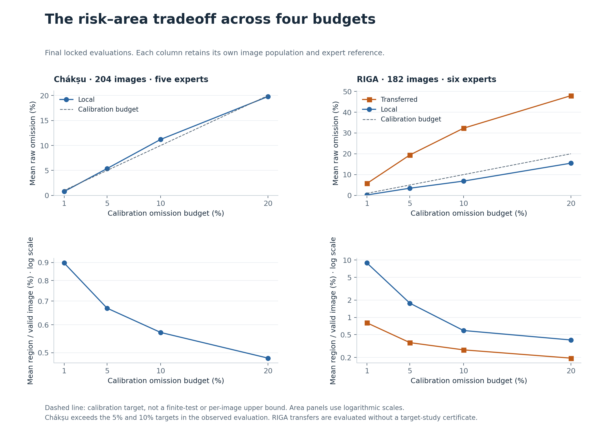
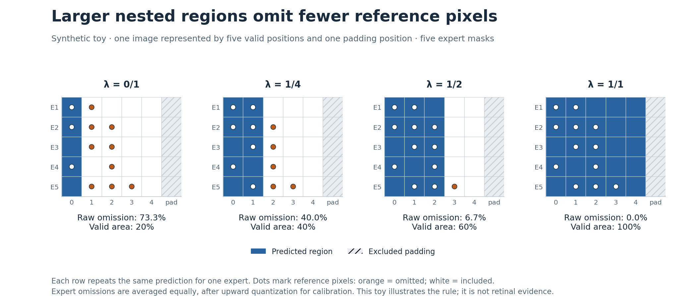
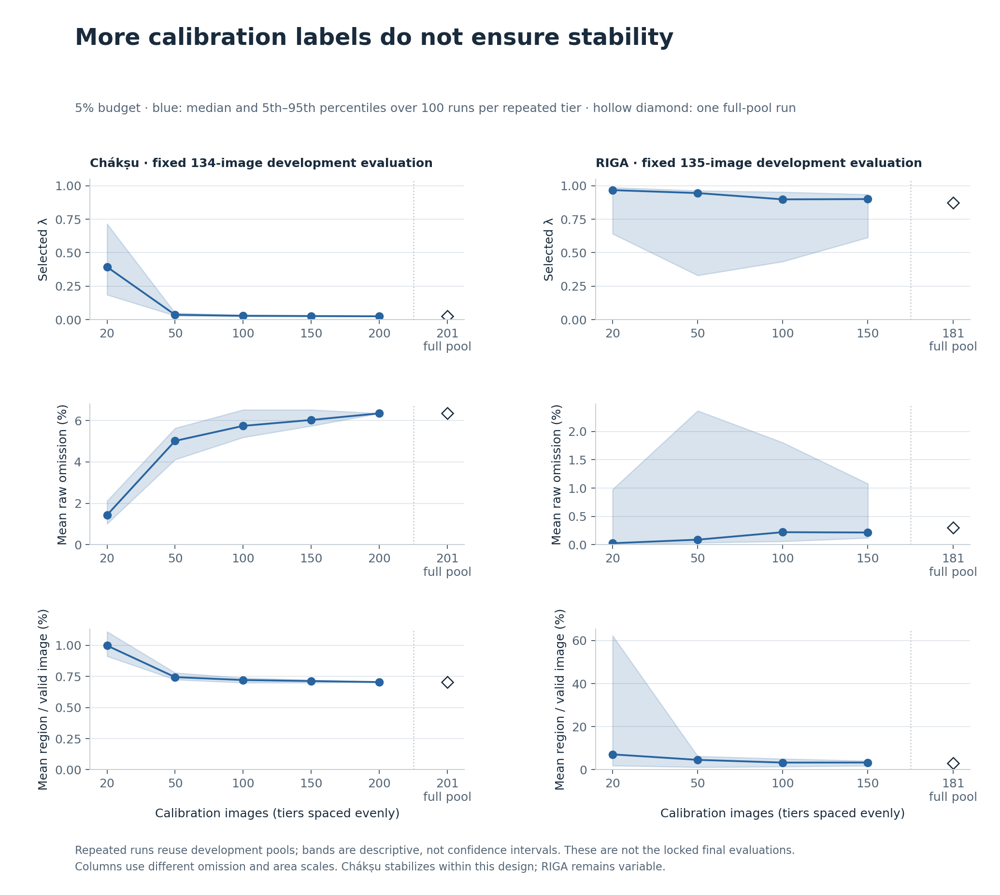
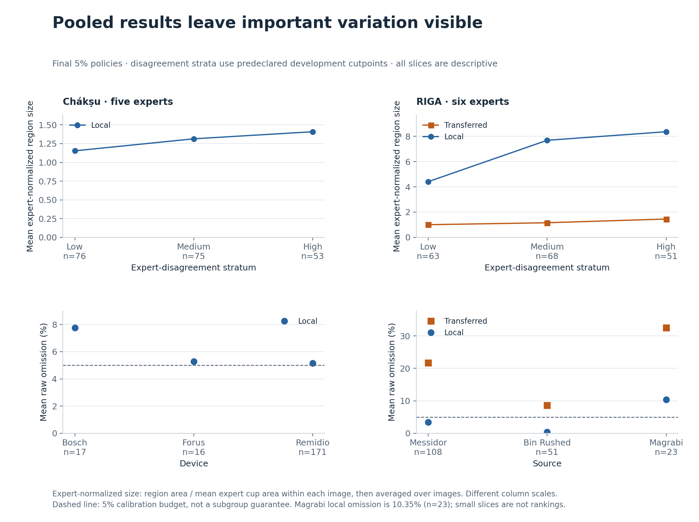

# Retinal segmentation as an uncertainty question

A segmentation score map is not yet a decision about how much anatomy may be omitted. This study asks how a fixed model's predicted region changes when omission tolerance, expert reference and calibration population change. The measured utility is spatial: region area and expert-normalized size. It is not diagnostic accuracy or clinical benefit.

## One frozen scorer, two research studies

Chákṣu supplies five individual expert masks per image. A U-Net with a ResNet34 encoder was developed on 605 Chákṣu images; its training target averaged the masks, while evaluation retained each expert. A separate 201-image final calibration set selected four policies, evaluated on 204 locked images. The model and 512-pixel raster protocol were then frozen.

RIGA supplies six expert-marked copies of each original. Reconstructing the individual cup contours produced six eligible positive masks for 679 of the 750 original images; 71 images were excluded. The four Chákṣu policies were transferred unchanged. Four new policies were calibrated on 181 RIGA images, then both policy families were compared on the same 182 locked images. There was no target-model retraining or normalization change.

| Final 5% policy | Evaluation population | Raw omission | Mean region / valid image |
| --- | --- | ---: | ---: |
| Chákṣu local | 204 images, five experts | 5.3732% | 0.6685% |
| Transferred to RIGA | 182 images, six experts | 19.4384% | 0.3626% |
| RIGA local | The same 182 images, six experts | 3.4541% | 1.7687% |

Local RIGA recalibration lowers mean omission by **15.9843 percentage points** and expands mean region area **4.8784-fold**. That comparison isolates the policy change on the same frozen evaluation set. It does not estimate a randomized or clinical treatment effect. Comparing Chákṣu with RIGA also changes the population and expert reference; those rows must not be pooled.

## What the calibration statement means

For each expert, the loss is the fraction of reference pixels omitted by the predicted region, rounded upward to a 1/10,000 grid. Loss is averaged equally across experts within each image. Nested score-threshold regions grow as λ increases, excluding padding. The controller selects the smallest grid point with `(sum Q_i + 1)/(n + 1) <= α`.

This is an application of established **bounded, monotone conformal risk control**, not a new theorem. Its statement concerns expected image-average loss, with expectation over calibration and a new exchangeable image under the assumptions. It has no delta parameter and does not guarantee a 95% probability that one fitted controller meets its target. A finite evaluation can exceed the budget, as Chákṣu does at 5% and 10%. The source calibration statement does not automatically transfer to RIGA. [Method and assumptions](method.md).

## Calibration labels and expert disagreement

The development experiments vary calibration sample size, holding evaluation pools fixed. The 902 aggregate runs consist of 100 runs at each repeated tier and one full-pool run per study. Chákṣu becomes stable within this design; RIGA's λ percentile width decreases only about 7.02% between n=20 and n=150. More labels did not produce uniformly tight behavior here. These repeated pools do not establish universal label requirements or confidence intervals for deployment performance.

The normalized region is larger in high-disagreement slices. That association does not imply that absolute region area must rise: in Chákṣu, the primary Spearman association is positive for normalized size and negative for absolute area. The choice of denominator changes the question. Source and device slices also remain variable: the local RIGA Magrabi slice has **10.3547% omission across 23 images**, despite the pooled 3.4541% result.

No stable subject linkage was available. The unit is an image, not a patient. Fixed expert panels do not establish clinical truth or guarantee coverage for every expert. Eligibility exclusions, contour reconstruction and small slices constrain interpretation. See the full [Chákṣu report](../experiments/chaksu/report.md), [RIGA report](../experiments/riga/report.md) and their protocols for development results, all budgets, worst-expert statistics and all-Ω counts.

## What this artifact contributes

The contribution is the experimental design, standalone exact implementation and transparent reproduction of the calibration and spatial tradeoffs. Public replay starts from reviewed aggregate evidence. It reproduces eight final decisions and the 902-run summaries, not original training, inference, annotation processing or image-level outcomes. Hashes establish the identity of included evidence, not the truth of every historical assumption. [Reproduction contract](reproduction.md).

This work originated in EyeTrustAI's development research and is authored by Alejandro Sanchez Guinea, its founder. The personal research artifact does not constitute product-level validation. Credit the original CRC authors, Chákṣu/RIGA contributors, and U-Net/ResNet authors. PolypGen and the later EyeTrustAI product-validation repository have separate scopes.
